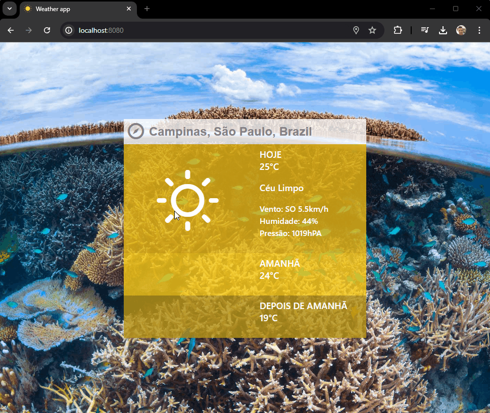

#  Charlie Challenge

Esta aplicação é um microsite responsivo para mostrar a previsão do tempo nas localidades informadas pelo usuário.



### 📋 Pré-requisitos

O que é preciso para executar a aplicação?

Docker
[Windows](https://docs.docker.com/desktop/install/windows-install/)
[Linux](https://docs.docker.com/desktop/install/linux-install/)
[MacOS](https://docs.docker.com/desktop/install/mac-install/)

O que é preciso para contribuir nesse projeto?

Node.js
[18.20.4(LTS)](https://nodejs.org/dist/v18.20.4/node-v18.20.4-x64.msi)

Git
(https://git-scm.com/downloads)

### 🔧 Instalação

Para a visualização do projeto é necessário somente o Docker para execução do projeto.

Execução:

```
docker compose up --build
```

Para preparar o ambiente de desenvolvimento são necessários alguns passos a mais.

Instalar a dependencias do client:

```
npm install
```

Instalar a dependencias do server:

```
cd server
npm install
```

Rodar a aplicação `server` em mode de desenvolvimento:

```
cd server
npm run dev
```

Rodar a aplicação `client` em mode de desenvolvimento:

```
npm run dev
```

Obs. Para fins de facilitar a DEMO as variáveis de ambientes sensíveis foram disponibilizadas no `.env` porém não é uma prática recomendada e as API Keys serão invalidadas após a demonstração desse desafio.

## ⚙️ Executando os testes

Para essa aplicação foram criados alguns testes unitários utlizando jest.
Foi configurado pre-commit stage utilizando husky para bloquear commits no caso de falha dos testes.

### 🔩 Analise o code coverage

Para analisar a cobertura do testes use o comando a seguir:

```
npm run test:coverage
```

### ⌨️ Execução dos teste

Execute os teste para verificar possíveis falhas.

```
npm run test:coverage
```

### ⌨️ Atualização do snapshot

Alguns testes utilizam de um snapshot para comparar se o layout ou estrutura do componente/página foi modificado.
Para isso é necessário atualizar o snapshot quando for alterado um componente o teste resulte em erro por diferença no snapshot.

```
npx jest --updateSnapshot
```

## 📄 Recursos utilizados neste projeto

[Bing Image API](https://www.bing.com/HPImageArchive.aspx?format=js&idx=0&n=1&mkt=pt-US)
[OpenWeather](https://openweathermap.org/forecast5)
[OpenCage](https://opencagedata.com/api)
[Meteocons Icons](http://www.alessioatzeni.com/meteocons/)

## 📄 Melhoria implementada

Foi sugerido utilizar o serviço `weather` da OpenWeather porém eu utilizei o serviço `forecast5` pois o mesmo possui a opção de filtrar o clima dos próximos `n` dias por query parameter.

Foi utilizada a lib `React-Query` para executar as chamadas HTTP e para fazer o cache das respostas, de forma que não seja necessário uma nova requisição no caso de uma busca com os mesmos parámetros pelos próximos 5 minutos.
